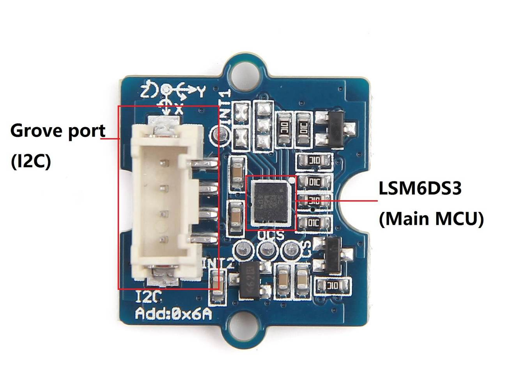

# LSM6DS3 Python Module for GrovePi and RaspberryPI

The code shown here refers to
the [Grove - 6-Axis Accelerometer and Gyroscope](https://www.seeedstudio.com/Grove-6-Axis-Accelerometer-Gyroscope.html)
sensor.

In the [official wiki documentation](https://wiki.seeedstudio.com/Grove-6-Axis_AccelerometerAndGyroscope/), 
the manufacturer provides the Arduino example. However, Raspberry Pi code is not provided. This repository
shows a Python code for using the Grove - 6-Axis Accelerometer&amp;Gyroscope with GrovePi shield and
a Raspberry Pi. The code here mentioned is an example of how to communicate with this sensor.

The sensor used is the `LSM6DS3`, can be found named `LSM6DS3TR` as well. And it connects to the
GrovePi by using a I2C port.

## Hardware used

- [GrovePi+](https://www.seeedstudio.com/GrovePi.html) shield.
- [Grove - 6-Axis Accelerometer and Gyroscope](https://www.seeedstudio.com/Grove-6-Axis-Accelerometer-Gyroscope.html).
- Raspberry Pi 3B or Raspberry Pi 4B.

## Documentation

Datasheet is provided in `/docs` folder.

## Setup

Just run it. No extra libraries are needed.

## References

- [Official code for Arduino](https://github.com/Seeed-Studio/Seeed_Arduino_LSM6DS3).
